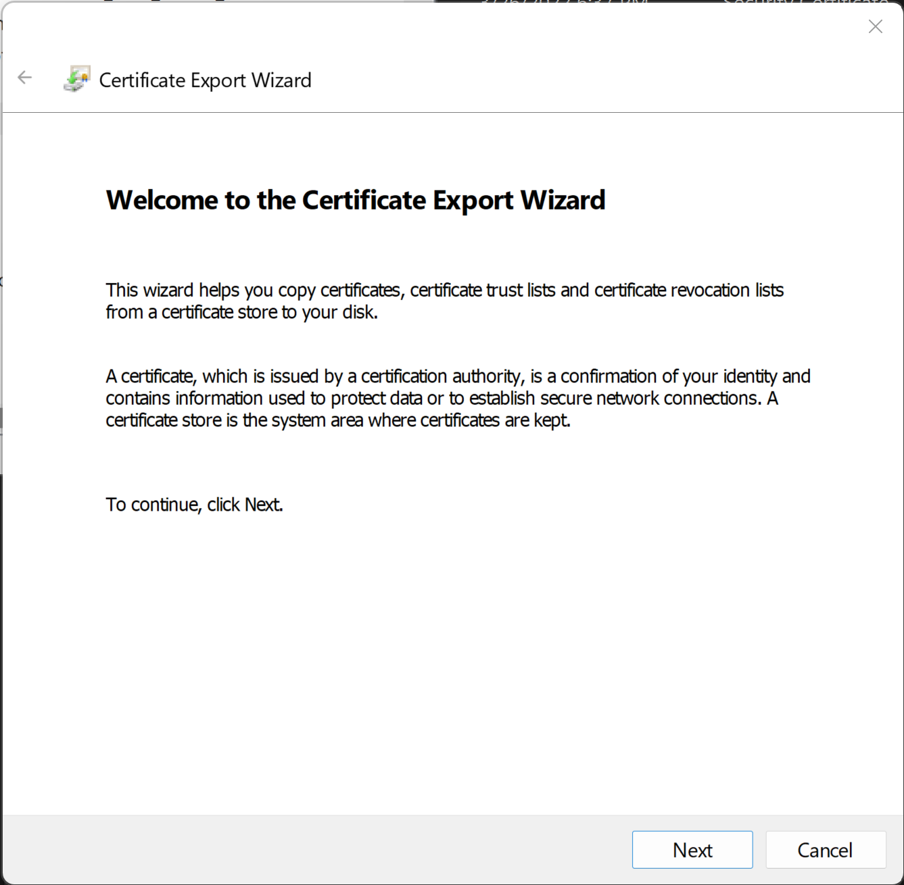
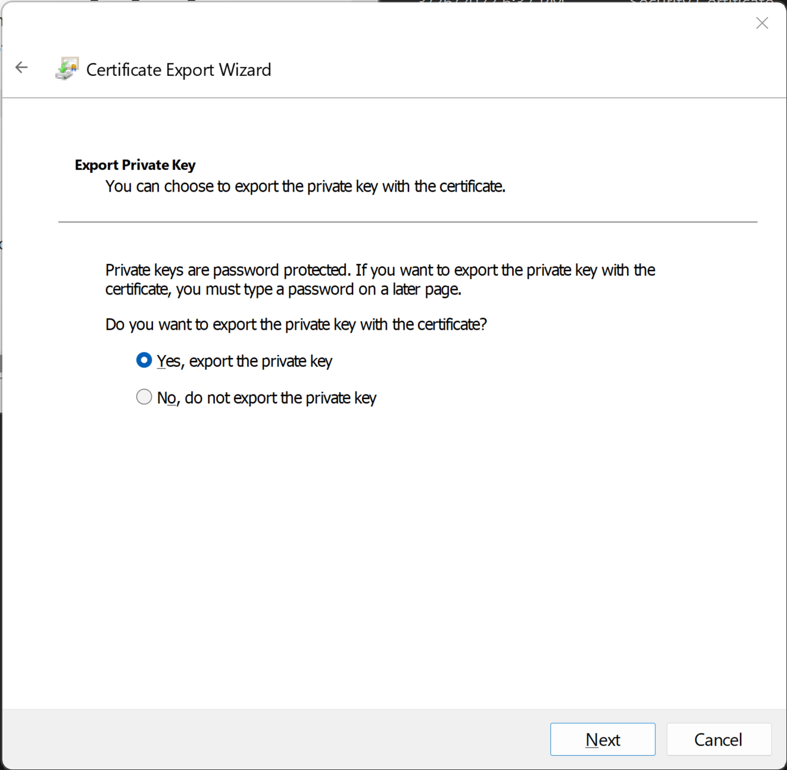
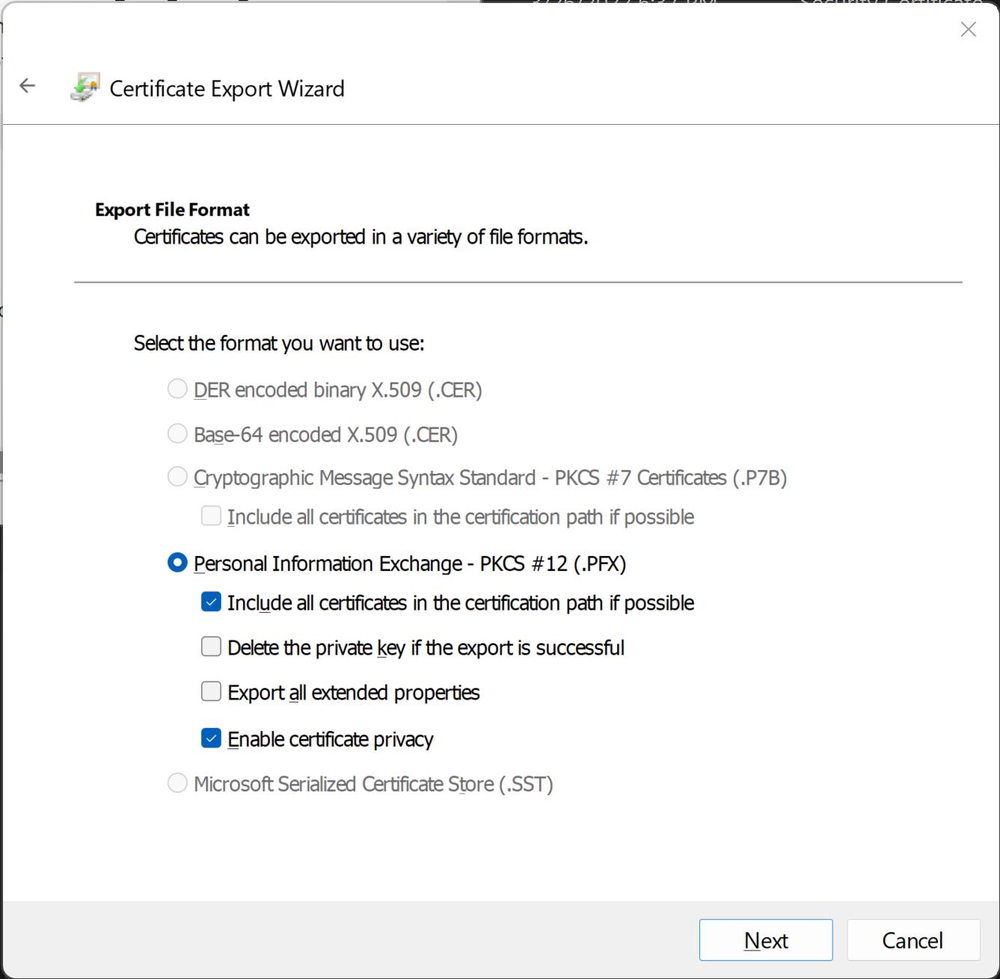
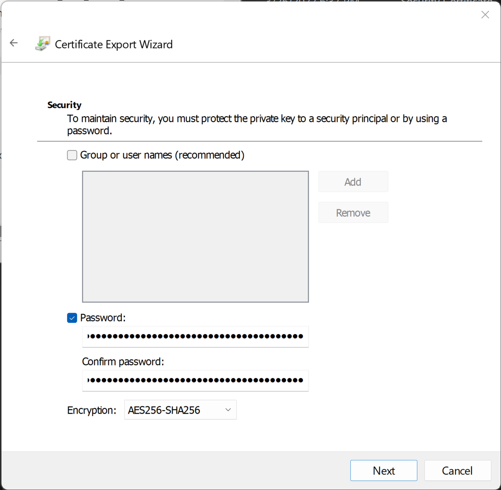
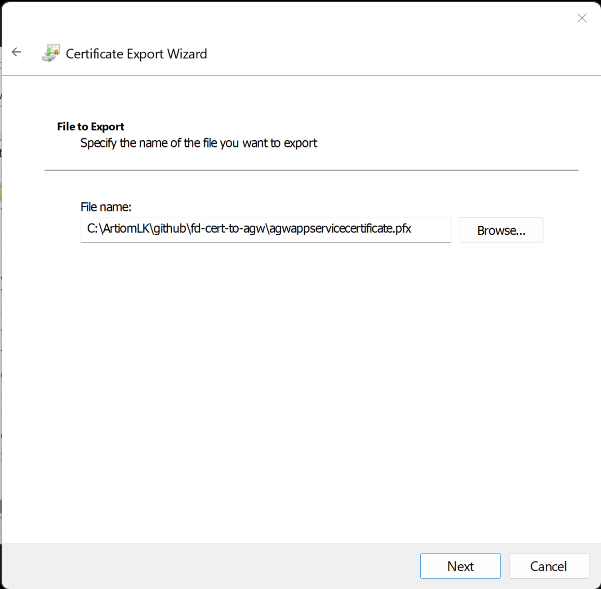
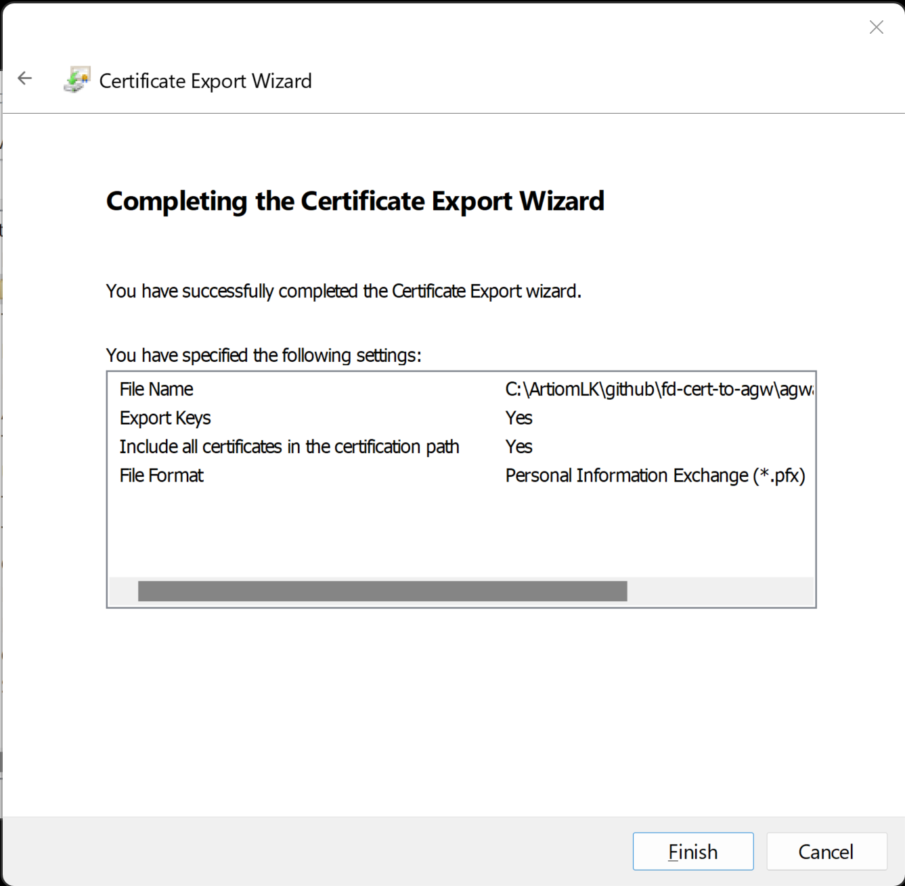
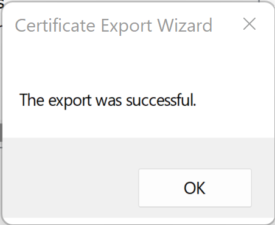

# Install the Certificate Locally

1. Cert Export Wizard
    - 

2. Cert Export With Private Key
    - 

3. Cert Export including all paths
    - 

4. Cert Export With Encryption
    - 

5. Cert Export Browse Location
   - 

6. Cert Export Final Step
   - 

7. Cert Export Successful
   - 
