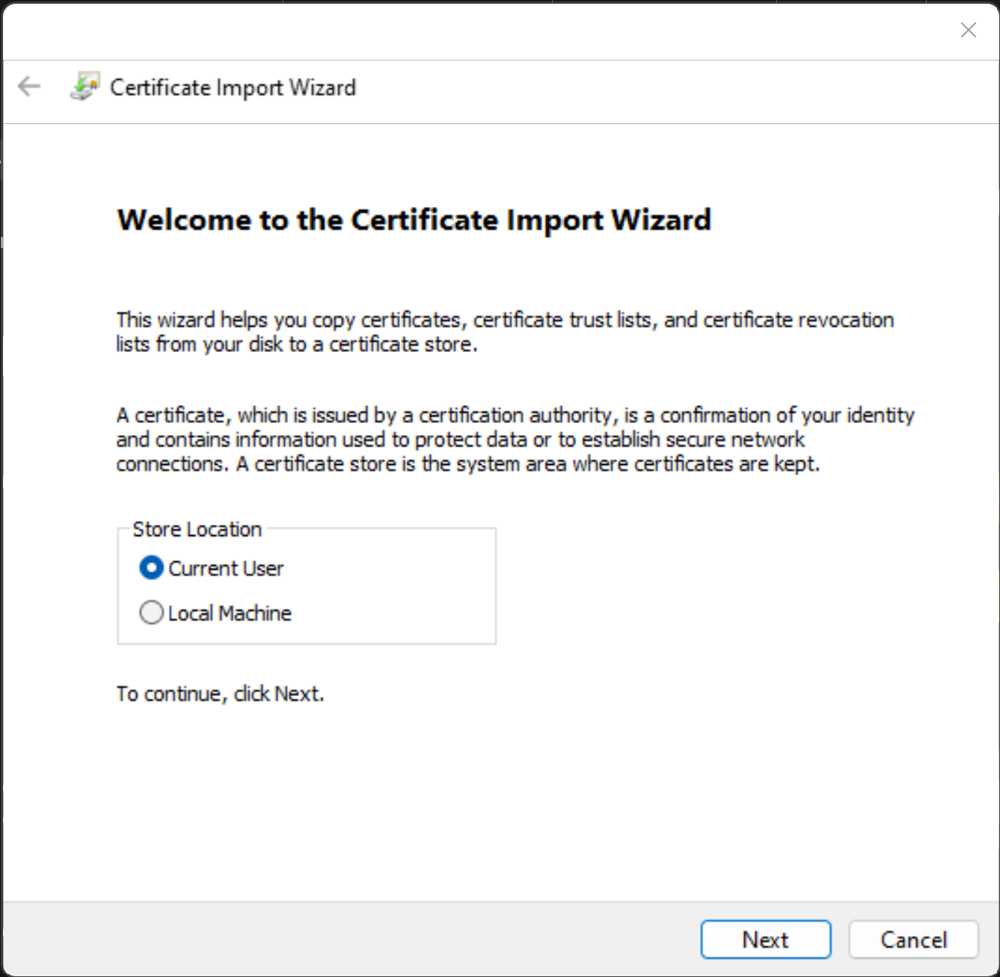
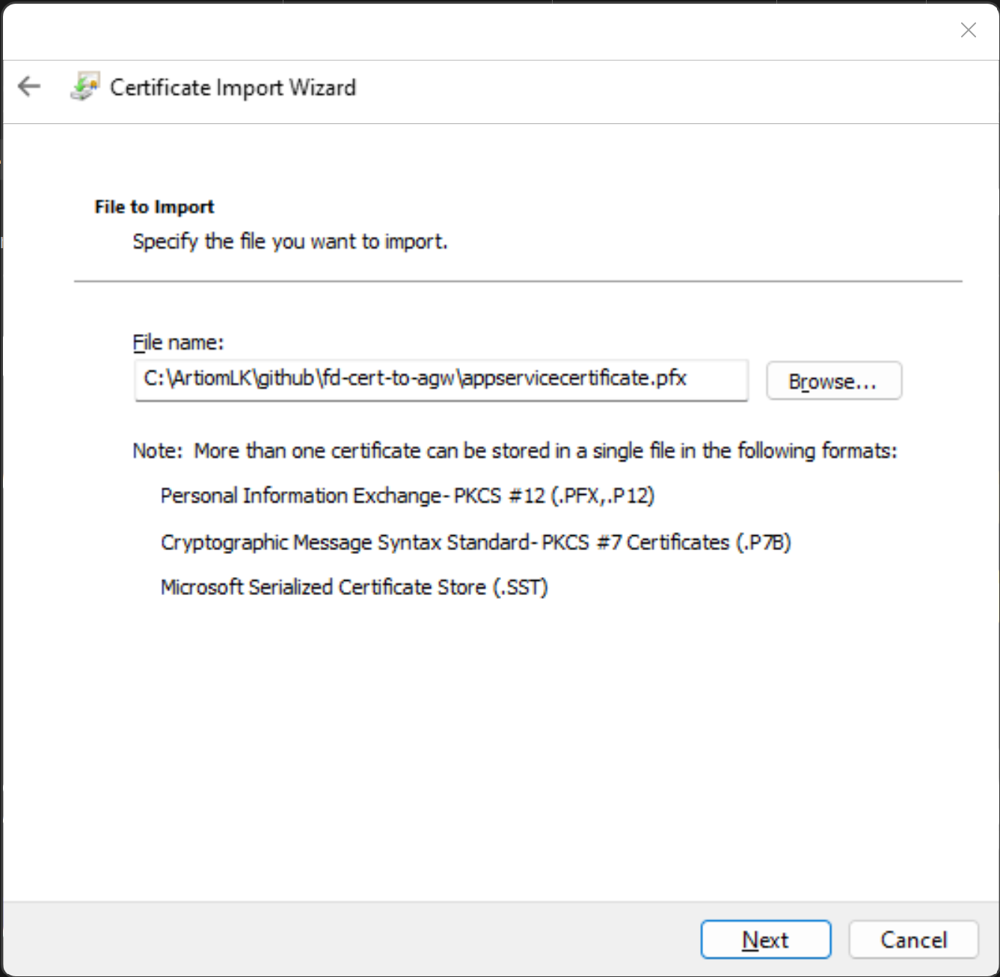
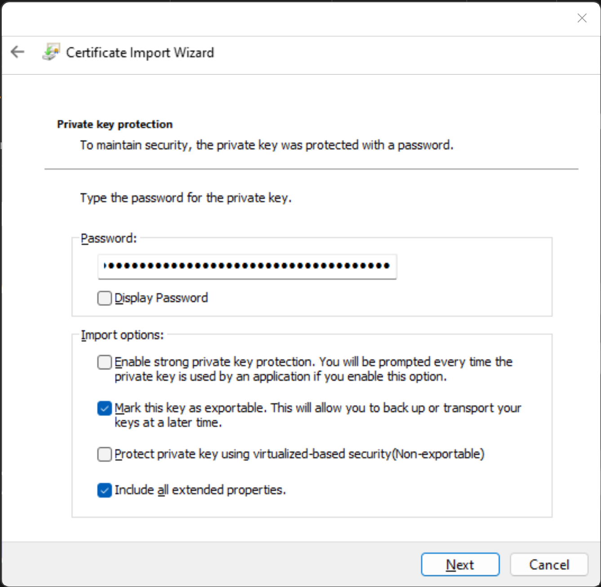
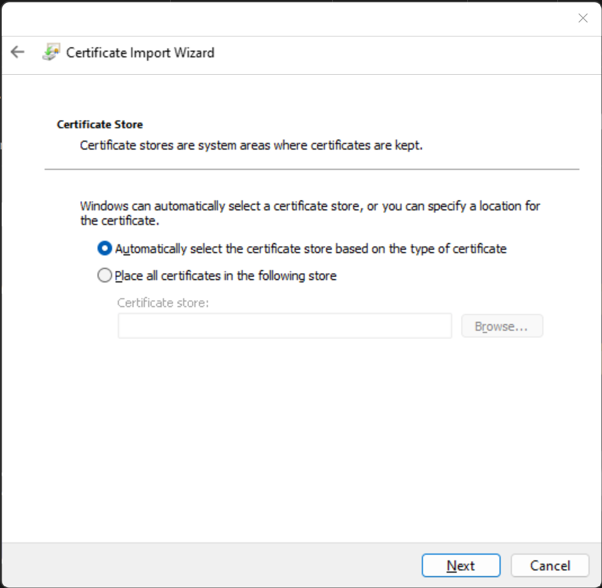
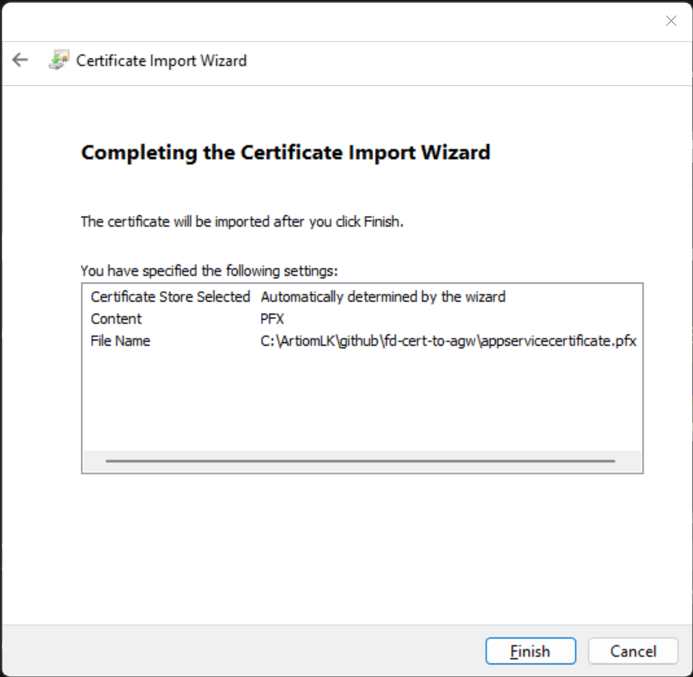
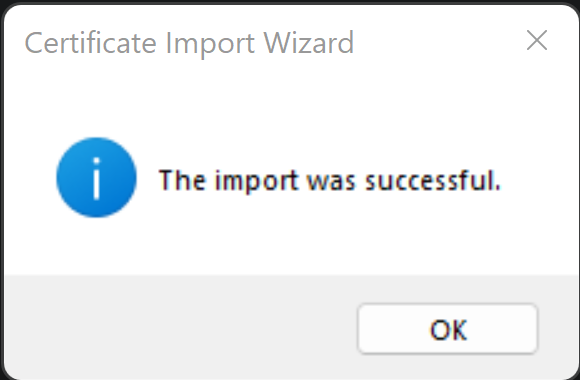

# Install the Certificate Locally

1. Cert Import Wizard
    - 

2. Cert Import Location
    - 

3. Cert Import Pass
    - 

4. Cert Import Store
    - 

5. Cert Import Final Step
   - 

6. Cert Import Successful
   - 
